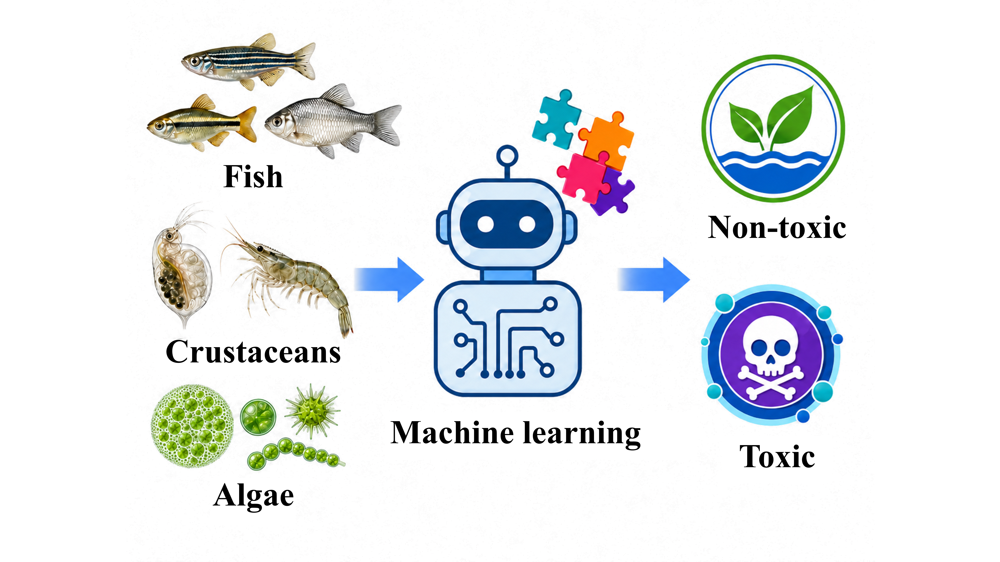

# AquaTox-multi

Multi-task prediction of aquatic toxicity for fish, crustaceans, and algae across EC50 and EC10 endpoints.

## Introduction

AquaTox-multi provides a reproducible workflow for predicting aquatic toxicity from molecular structures and exposure conditions. It combines molecular graph, fingerprint, descriptor, and exposure representations in a shared model for six organism–endpoint tasks.

<p align="center">
  
</p>

The model architecture is shown in [`figure/architecture.png`](figure/architecture.png).

## Installation

The reference environment uses Python 3.11, PyTorch 2.3 with CUDA 11.8, DGL 2.4, PyTorch Geometric 2.4, and RDKit 2023.9.1.

```bash
conda create -n aquatox-multi python=3.11.4 pip
conda activate aquatox-multi
python -m pip install -r requirements.txt
git lfs install
git lfs pull
```

Uni-Mol is an optional comparison model. Its Uni-Core dependency and external pretrained weight are described in [`weights/README.md`](weights/README.md).

## Usage

Use [`tutorials/predict.ipynb`](tutorials/predict.ipynb) for new-molecule prediction. The notebook accepts a SMILES string and the exposure fields `Duration_Value`, `effect`, and `media_type`, then loads the released fold checkpoints and training preprocessing artifacts.

For fixed-fold evaluation, use [`src/rfm/evaluate.py`](src/rfm/evaluate.py). Training is available through [`src/rfm/train.py`](src/rfm/train.py), with the optional Uni-Mol workflow under [`src/unimol_control/`](src/unimol_control/).

## Data and pretrained models

The model-ready table is [`data/aquatox/data/common_intersection_model.csv`](data/aquatox/data/common_intersection_model.csv). It contains six organism–endpoint tasks, harmonized `log10(mg/L)` labels, exposure metadata, molecule identifiers, and split metadata.

The common five-fold scaffold and acyclic-cluster assignments are under [`data/aquatox/manifests/`](data/aquatox/manifests/). The released GNN fold checkpoints are under [`models/aquatox_multi/`](models/aquatox_multi/). Install Git LFS before pulling the checkpoints.

## Repository layout

```text
data/aquatox/           Dataset, manifests, and metadata
models/aquatox_multi/   Released GNN fold checkpoints
figure/                 Project architecture and overview images
src/rfm/                Model, training, evaluation, and prediction code
src/unimol_control/     Optional Uni-Mol workflow
tutorials/predict.ipynb New-molecule prediction tutorial
weights/                External Uni-Mol weight instructions
```

## Citation / License

If you use this repository, please cite:

> Xiushan Wu, Baochuan Hu, Dongliang Chen, Jinrong Yang, and Xiao He. *A Unified Multi-Task Model for Aquatic Toxicity Prediction across Organism Groups and Effect Endpoints: A Comparison of Molecular Representations*.

Project-authored code and documentation are released under the [MIT License](LICENSE). Adapted third-party components and notices are listed in [`THIRD_PARTY_NOTICES.md`](THIRD_PARTY_NOTICES.md) and [`licenses/`](licenses/).
